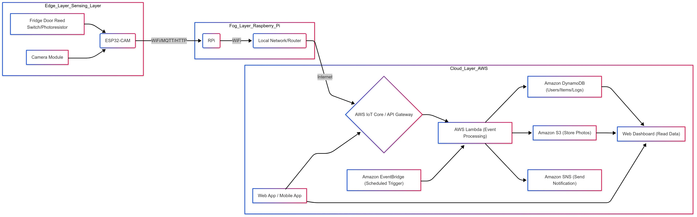
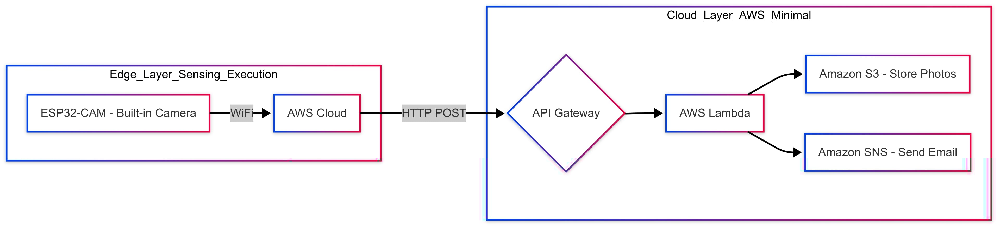

# Smart Fridge Guardian

A project leveraging IoT, Fog Computing, and Cloud technologies to create a smarter shared refrigerator experience, aiming to reduce food waste and prevent item misappropriation in shared environments like dorms or offices.

**Check out our Proposal: [Canva](https://www.canva.com/design/DAGj9VkcseQ/b5yoc1Te6HAapWB0cU6A4Q/edit?utm_content=DAGj9VkcseQ&utm_campaign=designshare&utm_medium=link2&utm_source=sharebutton)**

**Web Introduction: [GitHub Pages](https://hank1224.github.io/SmartFridgeGuardian/)**

This repository contains the implementation of the Proof of Concept (PoC) version.

## Table of Contents

*   [Full Project Vision](#full-project-vision)
*   [Proof of Concept (PoC) Implementation (This Repository)](#proof-of-concept-poc-implementation-this-repository)
    *   [Introduction & Problem Statement](#introduction--problem-statement)
    *   [PoC Goals](#poc-goals)
    *   [PoC Scope & Limitations](#poc-scope--limitations)
    *   [Target Users](#target-users)
    *   [System Architecture (PoC)](#system-architecture-poc)
    *   [Technology Stack (PoC)](#technology-stack-poc)
    *   [Core Functionality Flow (PoC)](#core-functionality-flow-poc)
    *   [Hardware Requirements (PoC)](#hardware-requirements-poc)
*   [Getting Started](#getting-started)
*   [Usage](#usage)
*   [Scalability & Future Enhancements](#scalability--future-enhancements)
*   [Challenges & Risks](#challenges--risks)
*   [License](#license)

## Full Project Vision

The ultimate goal of the **Smart Fridge Guardian** project is to develop a comprehensive, intelligent system for managing shared refrigerators. In its complete form, the system would tackle common issues like:

1.  **Food Theft/Misappropriation:** By tracking who accesses the fridge and potentially recognizing items, reducing the "who drank my milk?" problem.
2.  **Food Waste:** Monitoring item expiry dates and reminding users, preventing food from being forgotten and spoiling.
3.  **Lack of Effective Management:** Providing clear tracking of item ownership, registration time, and expiry dates.
4.  **Low Engagement:** Replacing tedious manual methods (like labels) with an interactive and tech-driven approach.

The full system envisions advanced features such as **automatic item recognition** using computer vision, **weight sensing** shelves to monitor quantity, sophisticated **anomaly detection** for suspicious activities, and potentially **social features** for item sharing or gifting within the user group. It aims to be a robust solution integrating Edge AI, Fog processing, and comprehensive Cloud services for data analysis, user interaction, and notifications.

### Full Project System Architecture

---

## Proof of Concept (PoC) Implementation (This Repository)

This repository focuses on building a **Proof of Concept (PoC)** system to demonstrate the core feasibility and essential functionalities of the Smart Fridge Guardian concept using a defined technology stack.

### Introduction & Problem Statement

Shared refrigerators in student dorms, club offices, or co-working spaces are convenient but often lead to management issues:

*   **Item Theft/Misappropriation:** Items mysteriously disappear, causing friction.
*   **Food Spoilage & Waste:** Items get lost in the back and expire unnoticed.
*   **Chaotic Management:** Difficulty tracking ownership, registration time, and expiry dates.
*   **Ineffective Methods:** Current solutions like sticky notes or verbal agreements are often ignored and inefficient.

This PoC aims to use IoT (ESP32-CAM), Fog Computing (Raspberry Pi), and Cloud (AWS) to build a system that addresses these problems in a foundational way, enhancing the shared fridge experience.

### PoC Goals

The primary objective is to build a working PoC system demonstrating the core functionalities:

1.  **Item Registration:** Allow users to register items (name, owner, estimated expiry date) via a simple Web/Mobile App.
2.  **Status Monitoring:** Use an edge device (ESP32-CAM) to detect fridge door opening events and capture a photo upon opening.
3.  **Data Transmission:** Reliably transmit the door event (timestamp) and photo identifier/data through a Fog node (Raspberry Pi) to the AWS Cloud.
4.  **Cloud Processing & Storage:** Store user data, item inventory, event logs, and photos on AWS. Implement basic expiry reminder logic.
5.  **Simple Notifications:** Implement AWS-based expiry reminders (e.g., via Email/SNS).
6.  **Data Visualization:** Provide a basic web dashboard displaying the current list of items in the fridge (owner, expiry) and recent door opening events.

### PoC Scope & Limitations

This PoC implementation has the following limitations:

*   **No** complex image recognition (e.g., automatic item/face identification).
*   **No** advanced sensors like weight sensors.
*   Simplified "suspicious activity" logic (e.g., only logs door openings; manual marking of item status in the PoC).
*   User Interface (UI) prioritizes functionality over aesthetics.

### Target Users

*   Students living in dorms with shared refrigerators.
*   Members of clubs or small teams using a shared office fridge.
*   Any group needing better management of a shared fridge resource.

### System Architecture (PoC)

The PoC employs a typical three-layer IoT architecture: Edge, Fog, and Cloud.

*   **Edge Layer:**
    *   **Hardware:** ESP32-CAM board (with WiFi, Bluetooth, Camera), Reed switch or Light Dependent Resistor (LDR) to detect door state.
    *   **Software:** MicroPython or Arduino C++ firmware.
    *   **Function:** Detects door opening, captures a photo, packages event data (timestamp) and photo, sends data to the Fog node (Raspberry Pi) via WiFi (MQTT or HTTP).
*   **Fog Layer (Raspberry Pi):**
    *   **Hardware:** Raspberry Pi (e.g., Model 3B+ or 4).
    *   **Software:** Python script, MQTT Broker (e.g., Mosquitto if using MQTT) or Web Server (e.g., Flask if using HTTP).
    *   **Function:** Acts as a data relay and buffer (improves resilience if cloud connection drops), performs optional preprocessing, serves as a security gateway, and uploads data securely to AWS (using AWS SDK/boto3 or MQTT) via API Gateway or IoT Core.
*   **Cloud Layer (AWS):**
    *   **Core Services:**
        *   **AWS IoT Core (Optional, Recommended for MQTT):** Secure device connection, management, and communication.
        *   **API Gateway:** Provides RESTful API endpoints for the Web/App frontend and the Fog node (if using HTTP).
        *   **AWS Lambda:** Serverless compute for processing data (triggered by API Gateway/IoT Core/EventBridge). Stores metadata in DynamoDB, photos in S3, triggers notifications via SNS, and performs scheduled expiry checks.
        *   **Amazon DynamoDB:** NoSQL database for `Users`, `Items` (ID, name, owner, registered\_ts, expiry\_date, photo\_s3\_key, status), and `Events` (timestamp, trigger\_device\_id, photo\_s3\_key).
        *   **Amazon S3:** Object storage for photos captured by the ESP32-CAM.
        *   **Amazon SNS:** Sends notifications (Email/SMS) for expiry reminders or events.
        *   **Amazon EventBridge:** Schedules regular triggers (e.g., daily) for the Lambda function performing expiry checks.
    *   **Frontend & Dashboard:**
        *   **Web App / Mobile App:** Interface for users to register items, view status, mark items as taken. Developed using frameworks like React/Vue/Angular, interacting with the backend via API Gateway.
        *   **Web Dashboard:** Displays fridge contents, event logs. Can be part of the App or a separate page.

### Technology Stack (PoC)

*   **Hardware:** ESP32-CAM, Raspberry Pi 4 Model B, Reed Switch, Jumper Wires, USB Power Supplies.
*   **Edge Software:** MicroPython / Arduino IDE (C++), Paho MQTT Client (if using MQTT).
*   **Fog Software:** Python 3, Paho MQTT / Flask, AWS SDK (boto3).
*   **Cloud (AWS):** IoT Core (Optional), API Gateway, Lambda (Python/Node.js), DynamoDB, S3, SNS, EventBridge.
*   **Frontend (Optional):** HTML, CSS, JavaScript (with React/Vue/Angular) or Mobile App Frameworks (React Native/Flutter).

### Core Functionality Flow (PoC)

1.  **Item Registration:** User -> App/Web -> API Gateway -> Lambda (RegisterItem) -> DynamoDB (Write to `Items` table).
2.  **Door Open & Photo Capture:** Reed Switch Trigger -> ESP32-CAM (Capture Photo) -> WiFi -> RPi (Receive/Forward) -> AWS IoT Core / API Gateway -> Lambda (ProcessDoorEvent) -> S3 (Store Photo), DynamoDB (Write to `Events` table, update photo link).
3.  **Expiry Reminder:** EventBridge (Scheduled Trigger) -> Lambda (CheckExpiry) -> DynamoDB (Query `Items` table) -> [If Expiring/Expired] -> SNS (Send notification to item owner).
4.  **Data Viewing:** User -> App/Web Dashboard -> API Gateway -> Lambda (GetFridgeContents/GetEvents) -> DynamoDB (Read data) -> App/Web (Display data).

### Hardware Requirements (PoC)

| Item                  | Specification/Model      | Quantity | Notes                            |
| :-------------------- | :----------------------- | :------- | :------------------------------- |
| ESP32-CAM Dev Board   | Incl. OV2640 Camera      | 1        | Built-in WiFi/BT                 |
| Raspberry Pi          | 4 Model B (2GB+ recomm.) | 1        | Incl. SD Card, Power Supply    |
| Reed Switch           | Normally Open (NO) type  | 1        | For door open/close detection    |
| Jumper Wires          | M-F / F-F                | Several  | For connecting components        |
| Micro USB Cable       | For ESP32 Power/Flash    | 1        |                                  |
| USB-C Power Supply    | For Raspberry Pi 4       | 1        |                                  |
| Micro SD Card         | 16GB+ Class 10           | 1        | For Raspberry Pi OS              |
| **AWS Cloud Services**| Various Services         | N/A      | PoC should stay within Free Tier |

## Getting Started

*(This section should provide instructions on how to set up and run the PoC code.)*

1.  **Hardware Setup:** Connect the reed switch to the ESP32-CAM. Power the ESP32-CAM and Raspberry Pi. Ensure the RPi is connected to the local network.
2.  **Edge Setup (ESP32-CAM):**
    *   Clone this repository.
    *   Navigate to the `/edge` or `/esp32` directory.
    *   Configure WiFi credentials and the Raspberry Pi's IP address/endpoint in the firmware code.
    *   Flash the firmware using Arduino IDE or esptool/Thonny (for MicroPython).
3.  **Fog Setup (Raspberry Pi):**
    *   Clone this repository onto the Raspberry Pi.
    *   Navigate to the `/fog` or `/rpi` directory.
    *   Set up a Python virtual environment and install dependencies (`requirements.txt`).
    *   Configure AWS credentials (use IAM roles or configure `~/.aws/credentials`).
    *   Configure the script (e.g., MQTT broker settings if used, AWS endpoints).
    *   Run the main Python script (e.g., `python fog_gateway.py`).
4.  **Cloud Setup (AWS):**
    *   Set up the required AWS services (API Gateway, Lambda, DynamoDB tables, S3 bucket, SNS topic, EventBridge rule) manually via the console or using an Infrastructure as Code tool (like Terraform or AWS SAM/CDK - *if provided*). Check the `/cloud` or `/aws` directory for configurations or Lambda code.
    *   Deploy the Lambda function code.
    *   Configure API Gateway to trigger the appropriate Lambda function(s).
    *   Set up IAM permissions correctly for Lambda to access DynamoDB, S3, and SNS.
    *   Subscribe your email address to the SNS topic for notifications.
5.  **Frontend Setup (Optional):**
    *   If a web interface is included (`/frontend` or `/web`), follow its specific setup instructions (e.g., `npm install`, `npm start`). Configure the API Gateway endpoint in the frontend code.
6.  **Running the System:** Once all components are running, open the fridge door. The ESP32 should capture an image and send it via the RPi to AWS. Check the S3 bucket, DynamoDB tables, and your email for notifications. Use the web dashboard (if available) to view data.

*(Note: Add more specific commands and configuration details based on your actual code structure)*

## Usage

1.  **Register Items:** Use the Web App/Dashboard to add items you place in the fridge, specifying the item name and expected expiry date.
2.  **Automatic Logging:** When the fridge door is opened, the system automatically logs the event time and captures a photo, storing them in the cloud.
3.  **View Status:** Check the Web Dashboard to see the current inventory, who owns what, expiry dates, and recent door opening events with associated photos.
4.  **Receive Notifications:** Get email alerts for items nearing their expiry date.

## Scalability & Future Enhancements

While this is a PoC, the architecture allows for future expansion:

*   **Functionality:**
    *   **Image Recognition:** Integrate AWS Rekognition or deploy lightweight models on the RPi for item/face recognition (respecting privacy).
    *   **Weight Sensing:** Add load cells under shelves for quantity estimation.
    *   **Smarter Alerts:** Develop more sophisticated logic for "suspicious activity" based on access patterns.
    *   **Social Features:** Implement item sharing, gifting, or swapping within the app.
    *   **Recipe Suggestions:** Recommend recipes based on available ingredients.
*   **Architecture:**
    *   **Multi-Fridge Support:** The cloud backend can be extended to manage multiple fridge units.
    *   **Load Balancing/Scaling:** Utilize AWS ELB, Auto Scaling for increased user load.
    *   **Data Analytics:** Use AWS QuickSight or other BI tools for insights into usage patterns, food waste, etc.

## Challenges & Risks

*   **Hardware Stability:** Ensuring the ESP32-CAM operates reliably in potentially cold/humid fridge environments.
*   **Network Reliability:** Dependence on stable WiFi connectivity in dorms/offices.
*   **Image Quality:** Poor lighting inside the fridge might affect photo usefulness.
*   **Cloud Costs:** Potential costs if AWS Free Tier limits are exceeded (low risk for PoC).
*   **Development Complexity:** Integrating multiple layers (hardware, embedded, fog, cloud, frontend).
*   **Privacy Concerns:** Handling photos requires clear user consent and secure data management. Avoid storing identifiable faces in the PoC.
