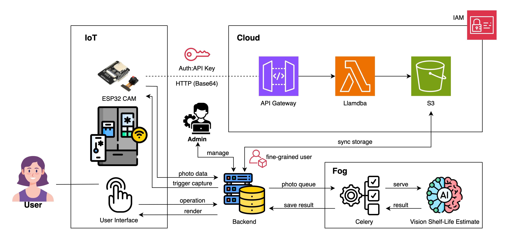

# Smart Fridge Guardian
*   **Web Introduction: [GitHub Pages](https://hank1224.github.io/SmartFridgeGuardian/)**

## Proof of Concept (PoC) Implementation (This Repository)

This repository focuses on building a **Proof of Concept (PoC)** system to demonstrate the core feasibility and essential functionalities of the Smart Fridge Guardian concept using a defined technology stack.

### Introduction & Problem Statement

Shared refrigerators in student dorms, club offices, or co-working spaces are convenient but often lead to management issues:

*   **Item Theft/Misappropriation:** Items mysteriously disappear, causing friction.
*   **Food Spoilage & Waste:** Items get lost in the back and expire unnoticed.
*   **Chaotic Management:** Difficulty tracking ownership, registration time, and expiry dates.
*   **Ineffective Methods:** Current solutions like sticky notes or verbal agreements are often ignored and inefficient.

This PoC aims to leverage Internet of Things (IoT) devices (ESP32-CAM) and a Cloud Backend (Django on AWS) to build a foundational system that addresses these problems, enhancing the shared fridge experience.

### PoC Goals

The primary objective is to build a working PoC system demonstrating the following core functionalities:

1.  **User Operation & Image Capture:** Allow logged-in users to select a fridge via a web interface and perform "Put In" or "Take Out" operations. These operations trigger the ESP32-CAM to capture a photo.
2.  **Image Upload & Storage:** Support two image upload mechanisms (ESP32 active push to cloud, or Backend pull from ESP32), and upload captured photos to cloud storage (AWS S3).
3.  **AI Image Content Recognition:** The system automatically invokes a Large Language Model (LLM) API to analyze photos stored in S3, identifying items, quantity, and estimating expiry dates.
4.  **Item Tracking & Data Storage:** Associate the LLM's recognition results with the performing user and store item information (owner, placement timestamp, recognition results, etc.) in the backend database.
5.  **Information Query Interface:**
    *   Provide an interface for system administrators to manage fridge devices.
    *   Provide an interface for fridge users to view the current general contents of a fridge (based on the latest analyzed photo) and a list of items they have stored.
6.  **Basic User Management:** Implement basic user registration, login, and role differentiation (Admin, Fridge User).

### PoC Scope & Limitations

This PoC implementation has the following limitations:

*   **Reliance on LLM for Image Recognition:** Accuracy and detail of item recognition depend on the capability of the chosen LLM.
*   **Simplified "Take Out" Operation:** When an item is "Taken Out", the system still takes and analyzes a photo. In the PoC phase, the system **does not** automatically compare photos to determine which items were removed. It primarily logs the operation and the state snapshot.
*   **No Advanced Sensors:** Does not include advanced hardware like weight sensors.
*   **No Automatic Door Sensor Trigger (in core PoC flow):** The core PoC flow relies on the user clicking a button on the interface to trigger photo capture, rather than automatic capture upon door opening (although the ESP32 hardware can be extended to support this).
*   **User Interface (UI):** Prioritizes functional implementation over aesthetic design.
*   **Security:** Implements basic security measures but not a production-grade comprehensive hardening.
*   **Notification Mechanism:** Core PoC does not include notification features like automatic expiry reminders (this can be a future extension).

### Target Users

*   Students living in dorms with shared refrigerators.
*   Members of clubs or small teams using a shared office fridge.
*   Any group needing better management of a shared fridge resource.

### PoC System Architecture

The PoC employs a simplified client-server architecture, integrating an edge device with cloud backend services.

*   **Edge Layer:**
    *   **Hardware:** ESP32-CAM development board (with WiFi, Camera module).
    *   **Software:** Arduino C++ firmware.
    *   **Function:**
        *   Connects to Wi-Fi.
        *   **Mode 1 (ESP32 Push):** Receives trigger signal from the backend (optional, or triggered by other sensors), captures a photo, and pushes image data and metadata (device ID, timestamp, operation correlation ID, etc.) to AWS API Gateway.
        *   **Mode 2 (Backend Pull):** Runs an HTTP server, receives photo capture command (`/api/photos`) from the Django backend, captures a photo, and returns Base64 encoded image data and metadata as the response.
*   **Backend & Cloud Layer:**
    *   **Core Application (Django Backend):**
        *   **Framework:** Python, Django.
        *   **Environment:** Cloud server (e.g., AWS EC2, Heroku, or other PaaS).
        *   **Function:**
            *   User management and authentication (Admin, Fridge User).
            *   Fridge device management (registering ESP32-CAM device info).
            *   Handling user "Put In" / "Take Out" requests.
            *   Triggering ESP32-CAM photo capture based on configuration (Mode 1 signal or Mode 2 pull).
            *   Receiving image data (directly in Mode 2, or S3 path notification in Mode 1).
            *   Uploading images to AWS S3 (if in Mode 2, or notified by Lambda in Mode 1).
            *   Creating `Photo` records.
            *   Triggering asynchronous tasks (Celery) to invoke LLM API for image analysis.
            *   Parsing LLM results, creating `RecognizedItem` records and storing in the database.
            *   Providing API endpoints for the frontend to query fridge contents and user's personal items.
    *   **Database:**
        *   **Type:** PostgreSQL (recommended) or MySQL/SQLite.
        *   **Storage:** `User`, `FridgeDevice`, `Photo`, `RecognizedItem` model data.
    *   **Object Storage:**
        *   **Service:** AWS S3 (Simple Storage Service).
        *   **Use:** Persistent storage for photos captured by the ESP32-CAM.
    *   **Large Language Model Service (LLM Service):**
        *   **Interface:** OpenAI compatible format API.
        *   **Use:** Image content recognition (items, quantity, estimated expiry).
    *   **Asynchronous Task Processing:**
        *   **Tool:** Celery (with Redis or RabbitMQ as Broker).
        *   **Use:** Handles time-consuming LLM image analysis tasks to avoid blocking the main application.
    *   **(Mode 1 Specific Components) AWS API Gateway & Lambda:**
        *   **API Gateway:** Receives actively pushed image data from ESP32-CAM, performs basic validation, triggers Lambda.
        *   **AWS Lambda:** Processes requests from API Gateway, stores images to S3, and notifies the Django backend with the S3 path and relevant metadata.
    *   **Frontend Interface:**
        *   **Technology:** Django Templates, HTML, CSS, JavaScript.
        *   **Function:** Provides interfaces for user registration/login, selecting fridge, operating fridge (triggering photo), viewing personal items, viewing fridge contents. Provides interface for admin to manage fridge devices.

### PoC Technology Stack

*   **Hardware:** ESP32-CAM development board.
*   **Edge Software:** Arduino IDE (C++).
*   **Backend:** Python, Django.
*   **Database:** PostgreSQL / MySQL / SQLite.
*   **Asynchronous Task Queue:** Celery.
*   **Message Broker (for Celery):** Redis / RabbitMQ.
*   **Image Storage:** AWS S3.
*   **Image Recognition:** OpenAI compatible format LLM API.
*   **HTTP Request Library (Python):** `requests`.
*   **AWS SDK (Python):** `boto3`.
*   **Django S3 Integration:** `django-storages`.
*   **Frontend:** Django Templates, HTML, CSS, JavaScript.
*   **(Required for Mode 1) Cloud API Service:** AWS API Gateway.
*   **(Required for Mode 1) Cloud Serverless Compute:** AWS Lambda.

### PoC Core Functionality Flow

1.  **Admin - Register Fridge Device:**
    *   Admin logs in -> Navigates to fridge management page -> Adds a new fridge device (name, ESP32's `device_id`, IP address (needed for Mode 2), etc.).
2.  **User - Put In Item:**
    *   User logs in -> Selects target fridge -> Clicks "Put In Item".
    *   Frontend sends request (including `fridge_id`, `user_id`, `operation_type='put_in'`) to Django backend.
    *   Django backend triggers image capture based on fridge configuration:
        *   **Mode 1 (ESP32 Push):** Backend *may* send a trigger signal to ESP32 (including operation ID). ESP32 takes photo and POSTs image data and metadata to AWS API Gateway -> Lambda -> S3. Lambda notifies Django backend with S3 path.
        *   **Mode 2 (Backend Pull):** Backend sends a GET request to ESP32's `/api/photos` endpoint. ESP32 takes photo and returns Base64 image data. Backend receives data and uploads to S3.
    *   Django backend creates a `Photo` record (status `pending`), associating it with the user and fridge.
    *   An asynchronous Celery task is triggered: Task retrieves image from S3, calls LLM API for analysis, parses result, creates `RecognizedItem` records (owner is the performing user), updates `Photo` status.
    *   User can later view recognized items on "My Items" or fridge content page.
3.  **User - Take Out Item (Simplified Flow):**
    *   Flow is similar to "Put In Item", but operation type is `take_out`. System still takes, uploads, and analyzes a photo. In PoC, no photo comparison is done to identify removed items.
4.  **User - View Personal Items:**
    *   User logs in -> Navigates to "My Items" -> Backend queries and displays the list of items put in and recognized as belonging to this user.
5.  **User - View Current Fridge Contents:**
    *   User selects a fridge -> Backend queries and displays the list of items identified in the latest successfully analyzed photo for that fridge, as a content overview.

### PoC Hardware Requirements

| Item                  | Specification/Model      | Quantity | Notes                                         |
| :-------------------- | :----------------------- | :------- | :-------------------------------------------- |
| ESP32-CAM Dev Board   | Incl. OV2640 Camera      | 1        | Built-in WiFi                                 |
| Micro USB Cable       | For ESP32 Power/Flash    | 1        |                                               |
| 5V USB Power Supply   | For ESP32 Power          | 1        |                                               |
| **AWS Cloud Services**| S3, API Gateway, Lambda (Mode 1), LLM API | N/A  | PoC should stay within Free Tier/low cost     |
| **Backend Hosting**   | Cloud server or Local Dev Machine | 1    | For running Django, Celery, Database          |

## Getting Started

*(This section should provide instructions on how to set up and run the PoC code.)*

1.  **Hardware Setup:** Connect power to the ESP32-CAM.
2.  **Edge Setup (ESP32-CAM):**
    *   Clone this repository.
    *   Navigate to the `/esp32` or similar directory.
    *   Configure WiFi credentials in the firmware code.
    *   **Configure based on selected mode:**
        *   **Mode 1:** Configure AWS API Gateway endpoint URL and API Key.
        *   **Mode 2:** No specific endpoint configuration needed, backend will access via IP.
    *   Compile and flash the firmware using Arduino IDE or PlatformIO. Get the ESP32's IP address from serial monitor (backend might need this for Mode 2).
3.  **Backend Setup (Django):**
    *   Clone this repository onto your server or local development machine.
    *   Navigate to the backend project directory (e.g., `/backend`).
    *   Set up a Python virtual environment and install dependencies (`requirements.txt`).
    *   Configure environment variables (`.env` file): Database connection string, AWS S3 keys, LLM API key, Celery Broker URL, etc.
    *   Run database migrations (`python manage.py migrate`).
    *   Run the Django development server (`python manage.py runserver`).
    *   Run the Celery worker (`celery -A your_project_name worker -l info`).
4.  **Cloud Setup (AWS - primarily for Mode 1 and S3):**
    *   Set up an S3 bucket and configure permissions.
    *   **If using Mode 1:**
        *   Set up API Gateway, create a `/upload` endpoint (POST), configure API key validation.
        *   Create a Lambda function (Python/Node.js) to handle requests from API Gateway. The code should include: decoding Base64 (if ESP32 pushes Base64 JSON), uploading image to S3, sending a notification to the Django backend's callback API (including S3 path, device ID, operation correlation ID, etc.).
        *   Configure API Gateway to trigger this Lambda function.
    *   Set up IAM permissions to ensure the Django backend (if running on EC2) or the Lambda function has access to S3.
5.  **Running the System:**
    *   Ensure the ESP32-CAM is connected to the network and running.
    *   Ensure the Django backend application and Celery worker are running.
    *   Access the web interface provided by Django.
    *   Log in as Admin and register a fridge device, entering the ESP32's IP (Mode 2) or ensuring the device ID matches the `DEVICE_ID` in the ESP32 firmware.
    *   Log in as a Fridge User, select a fridge, and perform a "Put In Item" operation.
    *   Check the S3 bucket for new photo uploads, the database for `Photo` and `RecognizedItem` records, and verify that the web interface updates.

*(Note: Add more specific commands and configuration details based on your actual code structure)*

## Usage

1.  **Manage Fridges:** System administrators can log in to add, view, or edit registered fridge device information.
2.  **Store Items:** Fridge users log in, select a fridge, and click "Put In Item". After physically placing items in the fridge, they confirm in the interface. The system triggers the photo capture, upload, and AI analysis process.
3.  **Retrieve Items:** Similar to storing, users select "Take Out Item" and confirm. The system records the current fridge snapshot.
4.  **View Status:**
    *   On the "My Items" page, view a list of items you've put in and that were recognized (name, quantity, placement time, estimated expiry, etc.).
    *   Select a specific fridge to view its current general contents (based on the latest successfully analyzed photo).

## Scalability & Future Enhancements

While this is a PoC, the architecture allows for future expansion:

*   **Functionality:**
    *   **More Accurate Item Tracking:** E.g., automatically identify added or removed items by comparing successive photos.
    *   **Door Sensor Integration:** Implement automatic photo capture upon door opening/closing.
    *   **Edge AI Optimization:** Run lightweight models on ESP32 for preliminary filtering or detection.
    *   **Expiry Reminders:** Provide notifications based on estimated expiry dates.
    *   **Richer UI/UX:** Develop a separate frontend application or mobile app.
*   **Architecture:**
    *   **Multi-Fridge Management:** The cloud backend can be extended to manage multiple fridge units.
    *   **Load Balancing/Scaling:** Utilize cloud services like AWS ELB, Auto Scaling for increased user load.
    *   **Data Analytics:** Use BI tools for insights into usage patterns, food waste, etc.

## Challenges & Risks

*   **Hardware Stability:** Ensuring the ESP32-CAM operates reliably in potentially cold/humid fridge environments.
*   **Network Reliability:** Dependence on stable WiFi connectivity in dorms/offices.
*   **Image Quality & LLM Accuracy:** Poor lighting inside the fridge can affect photo quality, impacting LLM recognition accuracy. LLM API costs and response time are also considerations.
*   **Cloud Costs:** Potential costs for S3 storage, LLM API calls, and other AWS services. Need to monitor usage.
*   **Development Complexity:** Integrating multiple layers of technology (embedded hardware, Django backend, Celery, cloud services, frontend).
*   **Privacy Concerns:** Handling photos requires clear user consent and secure data management.
*   **Maintaining Two Upload Modes:** Designing and maintaining two distinct image upload paths adds system complexity.

---